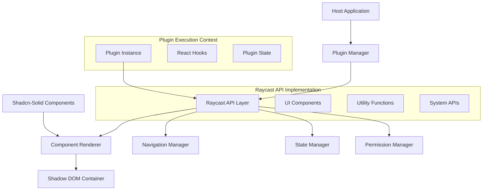

# Design Document

## Overview

This design document outlines the architecture for refactoring the current plugin system to be compatible with Raycast's plugin API while maintaining shadow-dom rendering. The system will provide a complete Raycast API implementation built on top of shadcn-solid components, ensuring both compatibility and modern UI foundations.

## Architecture

### High-Level Architecture



### Core Components

1. **Enhanced Plugin Manager**: Extended to support Raycast plugin conventions
2. **Raycast API Layer**: Complete implementation of Raycast's API surface
3. **Component Renderer**: Shadow-dom rendering system with shadcn-solid integration
4. **Navigation Manager**: Stack-based navigation system
5. **State Manager**: Plugin state isolation and persistence
6. **Permission Manager**: Enhanced permission system for Raycast APIs

## Components and Interfaces

### 1. Raycast API Layer

The Raycast API Layer provides the complete Raycast API surface that plugins expect:

```typescript
interface RaycastAPI {
  // UI Components
  List: ListComponent;
  Detail: DetailComponent;
  Form: FormComponent;
  Grid: GridComponent;
  Action: ActionComponent;
  ActionPanel: ActionPanelComponent;
  
  // Utility Functions
  showToast: (options: ToastOptions) => Promise<Toast>;
  showHUD: (title: string) => Promise<void>;
  open: (target: string, application?: string) => Promise<void>;
  getPreferenceValues: () => Record<string, any>;
  
  // Hooks
  useNavigation: () => NavigationHook;
  usePersistentState: <T>(key: string, initialValue: T) => [T, Dispatch<SetStateAction<T>>, boolean];
  
  // System APIs
  Clipboard: ClipboardAPI;
  AI: AIAPI;
  OAuth: OAuthAPI;
  BrowserExtension: BrowserExtensionAPI;
  Keyboard: KeyboardAPI;
}
```

### 2. Component Renderer with Shadcn-Solid Integration

The Component Renderer creates Raycast components using shadcn-solid as the foundation:

```typescript
interface ComponentRenderer {
  // Core rendering
  renderComponent(type: string, props: any, children?: ReactNode[]): ReactElement;
  createShadowContainer(pluginId: string): ShadowRoot;
  
  // Shadcn-solid integration
  createBaseComponent(shadcnComponent: SolidComponent, raycastProps: RaycastProps): ReactElement;
  applyRaycastStyling(component: ReactElement, theme: RaycastTheme): ReactElement;
  
  // Component mapping
  mapRaycastToShadcn(raycastType: string): SolidComponent;
}

// Example component implementations
class ListComponent {
  constructor(private renderer: ComponentRenderer) {}
  
  render(props: ListProps): ReactElement {
    const baseList = this.renderer.mapRaycastToShadcn('List');
    return this.renderer.createBaseComponent(baseList, props);
  }
}
```

### 3. Enhanced Plugin Manager

Extended to support Raycast plugin conventions:

```typescript
interface EnhancedPluginManager extends PluginManager {
  // Raycast plugin support
  loadRaycastPlugin(manifest: RaycastManifest): Promise<void>;
  registerRaycastCommand(command: RaycastCommand): void;
  
  // API injection
  injectRaycastAPI(pluginId: string): RaycastAPI;
  createPluginContext(pluginId: string): PluginExecutionContext;
  
  // Compatibility
  migrateFromCurrentSystem(plugin: PluginInstance): RaycastPlugin;
}

interface RaycastManifest {
  name: string;
  title: string;
  description: string;
  icon: string;
  author: string;
  commands: RaycastCommand[];
  preferences?: PreferenceSchema[];
}

interface RaycastCommand {
  name: string;
  title: string;
  description: string;
  mode: 'view' | 'no-view' | 'menu-bar';
  keywords?: string[];
  preferences?: PreferenceSchema[];
}
```

### 4. Navigation Manager

Stack-based navigation system compatible with Raycast patterns:

```typescript
interface NavigationManager {
  // Navigation stack
  push(component: ReactElement, title?: string): void;
  pop(): void;
  popToRoot(): void;
  
  // Navigation state
  getCurrentView(): ReactElement | null;
  getNavigationStack(): NavigationEntry[];
  
  // Hooks integration
  createNavigationHook(pluginId: string): NavigationHook;
}

interface NavigationHook {
  push: (component: ReactElement, title?: string) => void;
  pop: () => void;
  popToRoot: () => void;
}

interface NavigationEntry {
  component: ReactElement;
  title?: string;
  timestamp: number;
}
```

### 5. State Manager

Plugin state isolation and persistence:

```typescript
interface StateManager {
  // Plugin state isolation
  createPluginStateContext(pluginId: string): PluginStateContext;
  destroyPluginStateContext(pluginId: string): void;
  
  // Persistent state
  getPersistentState<T>(pluginId: string, key: string): T | undefined;
  setPersistentState<T>(pluginId: string, key: string, value: T): void;
  
  // Hooks integration
  createPersistentStateHook<T>(pluginId: string): PersistentStateHook<T>;
}

interface PersistentStateHook<T> {
  (key: string, initialValue: T): [T, Dispatch<SetStateAction<T>>, boolean];
}
```

## Data Models

### 1. Raycast Component Props

```typescript
// List Component
interface ListProps {
  children?: ReactNode;
  searchBarAccessory?: ReactElement;
  onSearchTextChange?: (text: string) => void;
  throttle?: boolean;
}

interface ListItemProps {
  id?: string;
  title: string;
  subtitle?: string;
  icon?: ImageLike;
  accessories?: Accessory[];
  actions?: ReactElement;
  detail?: ReactElement;
}

// Detail Component
interface DetailProps {
  children?: ReactNode;
  markdown?: string;
  metadata?: ReactElement;
  actions?: ReactElement;
}

// Form Component
interface FormProps {
  children?: ReactNode;
  actions?: ReactElement;
  onSubmit?: (values: FormValues) => void;
}

// Grid Component
interface GridProps {
  children?: ReactNode;
  columns?: number;
  inset?: Grid.Inset;
  fit?: Grid.Fit;
  searchBarAccessory?: ReactElement;
}
```

### 2. Plugin Execution Context

```typescript
interface PluginExecutionContext {
  pluginId: string;
  api: RaycastAPI;
  state: PluginStateContext;
  navigation: NavigationManager;
  shadowRoot: ShadowRoot;
  cleanup: () => void;
}

interface PluginStateContext {
  reactState: Map<string, any>;
  persistentState: Map<string, any>;
  hooks: Map<string, any>;
}
```

### 3. Component Mapping Configuration

```typescript
interface ComponentMapping {
  raycastType: string;
  shadcnComponent: string;
  propsTransform?: (raycastProps: any) => any;
  styleOverrides?: CSSProperties;
  customRenderer?: (props: any) => ReactElement;
}

const COMPONENT_MAPPINGS: ComponentMapping[] = [
  {
    raycastType: 'List',
    shadcnComponent: 'Command',
    propsTransform: (props) => ({
      ...props,
      className: 'raycast-list'
    })
  },
  {
    raycastType: 'List.Item',
    shadcnComponent: 'CommandItem',
    propsTransform: (props) => ({
      value: props.id || props.title,
      children: props.title
    })
  },
  // ... more mappings
];
```

## Error Handling

### 1. Plugin Loading Errors

```typescript
class RaycastPluginError extends Error {
  constructor(
    message: string,
    public code: string,
    public pluginId?: string,
    public cause?: Error
  ) {
    super(message);
    this.name = 'RaycastPluginError';
  }
}

enum ErrorCodes {
  INVALID_MANIFEST = 'INVALID_MANIFEST',
  COMPONENT_RENDER_FAILED = 'COMPONENT_RENDER_FAILED',
  API_NOT_AVAILABLE = 'API_NOT_AVAILABLE',
  NAVIGATION_FAILED = 'NAVIGATION_FAILED',
  STATE_CORRUPTION = 'STATE_CORRUPTION'
}
```

### 2. Component Rendering Errors

```typescript
interface ComponentErrorBoundary {
  componentDidCatch(error: Error, errorInfo: ErrorInfo): void;
  render(): ReactElement;
}

class RaycastComponentErrorBoundary extends React.Component implements ComponentErrorBoundary {
  state = { hasError: false, error: null };
  
  componentDidCatch(error: Error, errorInfo: ErrorInfo) {
    console.error('Raycast component error:', error, errorInfo);
    this.setState({ hasError: true, error });
  }
  
  render() {
    if (this.state.hasError) {
      return <ErrorFallback error={this.state.error} />;
    }
    return this.props.children;
  }
}
```

## Testing Strategy

### 1. Unit Testing

- **Component Rendering**: Test each Raycast component renders correctly with shadcn-solid base
- **API Functions**: Test all utility functions (showToast, showHUD, etc.) work as expected
- **State Management**: Test plugin state isolation and persistence
- **Navigation**: Test navigation stack operations

### 2. Integration Testing

- **Plugin Loading**: Test loading real Raycast plugins
- **Shadow DOM Isolation**: Test style and DOM isolation between plugins
- **API Compatibility**: Test compatibility with existing Raycast plugin patterns
- **Performance**: Test rendering performance with multiple plugins

### 3. Compatibility Testing

- **Raycast Plugin Migration**: Test migrating existing Raycast plugins
- **API Surface Coverage**: Test all Raycast API functions are implemented
- **Component Behavior**: Test components behave identically to Raycast
- **Hook Compatibility**: Test React hooks work correctly in plugin context

### 4. End-to-End Testing

- **Plugin Lifecycle**: Test complete plugin activation/deactivation cycle
- **Multi-Plugin Scenarios**: Test multiple plugins running simultaneously
- **Navigation Flows**: Test complex navigation scenarios
- **Error Recovery**: Test error handling and recovery scenarios

## Performance Considerations

### 1. Component Rendering Optimization

- **Virtual Scrolling**: Implement virtual scrolling for large lists
- **Component Memoization**: Use React.memo for expensive components
- **Lazy Loading**: Load plugin components on-demand
- **Shadow DOM Optimization**: Minimize shadow DOM creation overhead

### 2. Memory Management

- **Plugin State Cleanup**: Ensure proper cleanup when plugins deactivate
- **Event Listener Management**: Clean up event listeners in shadow DOM
- **Component Unmounting**: Proper React component unmounting
- **Memory Leak Prevention**: Monitor and prevent memory leaks

### 3. Bundle Size Optimization

- **Tree Shaking**: Ensure unused Raycast API parts are tree-shaken
- **Code Splitting**: Split Raycast API into loadable chunks
- **Shadcn-Solid Optimization**: Only include used shadcn-solid components
- **Plugin Bundling**: Optimize plugin bundle sizes

## Security Considerations

### 1. Shadow DOM Isolation

- **Style Isolation**: Prevent CSS injection between plugins
- **DOM Isolation**: Prevent DOM manipulation across boundaries
- **Event Isolation**: Ensure events don't leak between plugins
- **Script Isolation**: Prevent script execution in wrong context

### 2. API Access Control

- **Permission Validation**: Validate plugin permissions before API access
- **Capability Restrictions**: Restrict API access based on plugin manifest
- **Secure Storage**: Encrypt sensitive plugin data
- **Network Security**: Validate and sanitize network requests

### 3. Plugin Sandboxing

- **Execution Context**: Isolate plugin execution contexts
- **Resource Limits**: Limit plugin resource usage
- **API Rate Limiting**: Prevent API abuse
- **Error Containment**: Contain plugin errors to prevent system crashes